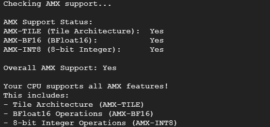
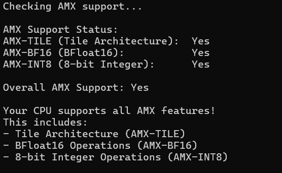

<p align="center">
  
</p>

# Intel® AMX Validation for Linux and Windows 

© Copyright 2025, Intel Corporation

## Overview
This Python script detects the presence of Intel AMX features on your CPU by using the cpuid command-line tool to query processor capabilities. 

AMX (Advanced Matrix Extensions) is a set of instructions introduced in Intel's 3rd Generation Xeon Scalable processors (codenamed "Sapphire Rapids") that significantly accelerates AI workloads, deep learning, and matrix multiplication operations.

The CPUID instruction is a processor supplementary instruction allowing software to discover details of the processor. By examining the CPUID output and checking the relevant bits, you can determine if the CPU supports certain instruction sets or features. The cpuid -1 command queries the CPU's feature set. When AMX is enabled, it should show a specific bit set in the ECX register. It checks for three specific AMX features:
 
- **AMX-TILE:** The tile architecture foundation. <br />
- **AMX-BF16:** Support for BFloat16 operations. <br />
- **AMX-INT8:** Support for 8-bit integer operations.

### Why Check for AMX Support?
AMX can provide significant performance improvements for:

- Machine learning applications
- AI inference workloads
- Scientific computing
- Applications using matrix operations

Detecting AMX support helps determine if your system can benefit from AMX-optimized software and libraries like Intel's oneAPI, PyTorch with Intel extensions, or TensorFlow with oneDNN.

## Prerequistes
### Linux
- Python 3.6 or higher
- cpuid utility installed
```bash
sudo apt-get update
sudo apt-get install cpuid
```
- To verify that cpuid is installed correctly run:
```bash
cpuid -v
```

### Windows
- Python 3.6 or higher
- Microsoft Visual Studio 2022 <br />
Once Visual Studio is installed click on the Tools tab and navigate to the "Get Tools and Features" section. Ensure that the following settings are selected and then select install while downloading in the bottom right. 
    <br/> 

**Note:** CPUID instruction capability is not available on windows. This instruction will be called from an executable file instead when running on windows.

## Usage
### Linux 
1. Launch an instance on desired platform and SSH into instance
2. Create AMX detection file 
```bash
nano amx-detect-linux.py
```
3. Paste contents of the amx-detect-linux.py file into the newly created file and save.
4. Make the script executable 
```bash
chmod +x amx-detect-linux.py 
```
5. Run the script
```bash
sudo python3 amx-detect-linux.py
```
### Expected Output 
If AMX is enabled on the CPU the script should output the following



**Note:** The following command can be used to query specific CPU feature information:
```bash
cpuid -l 7 -s 0
```

-l 7: Specifies CPUID leaf 7, which contains information about extended features
-s 0: Specifies sub-leaf 0 of leaf 7

Leaf 7, sub-leaf 0 contains information about various CPU extensions including AVX-512, AMX, and other advanced features. The script parses this output to detect AMX-specific capabilities. This particular leaf/sub-leaf combination is used because Intel placed AMX feature flags in this location of the CPUID instruction output.
You can manually run this command to see the raw CPUID information that the script parses:


### Windows
1. Launch Windows instance and RDP into instance
2. Download the cpuid_feature_bits.c source file and save to the downloads folder
3. From the downloads folder, open the source file with visual studio and open the terminal
4. Navigate to the downloads directory
5. Compile the source file by running the following command 
```bash
cl cpuid_feature_bits.c
``` 


6. Once finished compiling, a cpuid_feature_bits.exe file should be outputted to the downloads folder. Exit out of visual studio. 
7. Open command prompt and navigate to the Downloads directory. 
8. Create the amx-detect-windows.py script by running 
```bash
notepad amx-detext-windows.py
```
9. Paste contents of the amx-detect-windows.py file into the newly created file and save.
10. Run the script by running 
```bash
py amx-detext-windows.py
```
### Expected Output
If AMX is enabled on the CPU the script should output the following



## More Information
For more information regarding AMX please visit the following developer guide: https://www.intel.com/content/www/us/en/content-details/671488/intel-64-and-ia-32-architectures-optimization-reference-manual-volume-1.html
