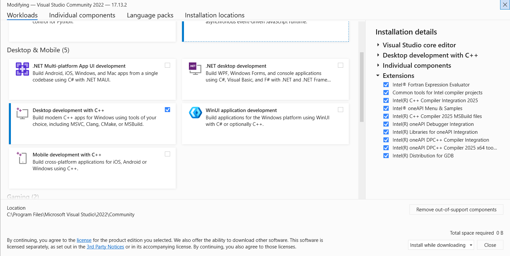
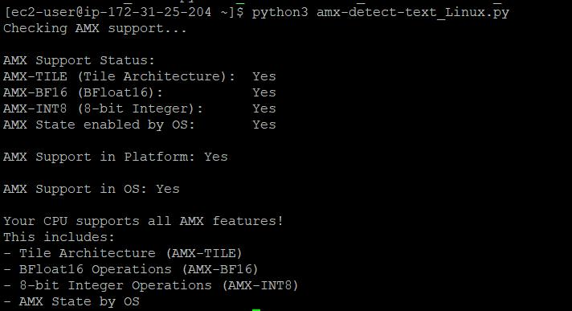
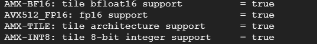
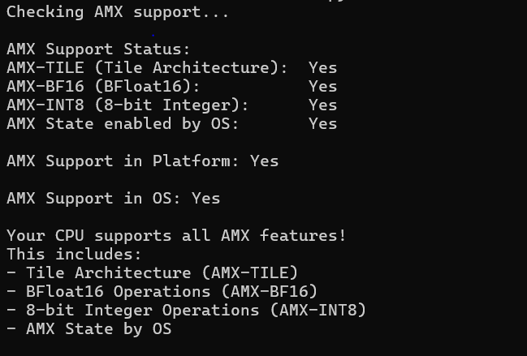

<p align="center">
  
</p>

# Intel® AMX Validation for Linux and Windows 

© Copyright 2025, Intel Corporation

## Overview
This Python script detects the presence of Intel AMX features on your CPU as well as OS by using the cpuid instruction to query processor capabilities. 

AMX (Advanced Matrix Extensions) is a set of instructions introduced in Intel's 4th Generation Xeon Scalable processors (codenamed "Sapphire Rapids") that significantly accelerates AI workloads, deep learning, and matrix multiplication operations.

The CPUID instruction is a processor supplementary instruction allowing software to discover details of the processor. By examining the CPUID output and checking the relevant bits, you can determine if the CPU supports certain instruction sets or features. The cpuid -1 command queries the CPU's feature set. When AMX is enabled, it should show a specific bit set in the ECX register. It checks for three specific AMX features:
 
- **AMX-TILE:** The tile architecture foundation. <br />
- **AMX-BF16:** Support for BFloat16 operations. <br />
- **AMX-INT8:** Support for 8-bit integer operations.

## How the Script Works 
This script detects AMX (Advanced Matrix Extensions) support by working with a companion executable (amx_detection) and analyzing its output. Here's how it works:
### AMX Enablement in the CPU
For CPU support detection:

The script runs an external program called amx_detection which presumably queries CPU information via CPUID instruction
It parses the output looking for specific CPU feature flags:

CPUID.07H.00H:EDX[22] indicates AMX-BF16 support
CPUID.07H.00H:EDX[24] indicates AMX-TILE support
CPUID.07H.00H:EDX[25] indicates AMX-INT8 support
### AMX Enablement in the OS
For OS detection:

The script uses XGETBV instruction to read XCR0 register which is a control register that indicates which processor states the operating system is configured to manage using the XSAVE feature set. 

### Why Check for AMX Support?
AMX can provide significant performance improvements for:

- Machine learning applications
- AI inference workloads
- Scientific computing
- Applications using matrix operations

Detecting AMX support helps determine if your system can benefit from AMX-optimized software and libraries like Intel's oneAPI, PyTorch with Intel extensions, or TensorFlow with oneDNN.

## Prerequistes
### Linux
- Python 3.6 or higher


### Windows
- Python 3.6 or higher
- Microsoft Visual Studio 2022 <br />
Once Visual Studio is installed click on the Tools tab and navigate to the "Get Tools and Features" section. Ensure that the following settings are selected and then select install while downloading in the bottom right. 
    <br/> 


## Usage
### Linux 
1. Launch an instance on desired platform and SSH into instance
2. Download and store amx-detect-linux.py, amx_os_linux.c, amx_detection.c, amx_detection.h in Downloads folder

3. Compile both amx_os_linux.c and amx_detection.c together
```bash
gcc -o amx_detection amx_detection.c amx_os_linux.c
```
4. Compiling these files should output the executable amx_detection to the Downloads folder
5. Run the script
```bash
python3 amx-detect-linux.py
```
### Expected Output 
If AMX is enabled on the CPU and OS the script should output the following



**Note:** The following command can be used to query specific CPU feature information after installing cpuid:

```bash
sudo apt install cpuid
```
```bash
cpuid -l 7 -s 0
```

-l 7: Specifies CPUID leaf 7, which contains information about extended features
-s 0: Specifies sub-leaf 0 of leaf 7

Leaf 7, sub-leaf 0 contains information about various CPU extensions including AVX-512, AMX, and other advanced features. The script parses this output to detect AMX-specific capabilities. This particular leaf/sub-leaf combination is used because Intel placed AMX feature flags in this location of the CPUID instruction output.
You can manually run this command to see the raw CPUID information that the script parses:




### Windows
1. Launch Windows instance and RDP into instance
2. Download and store amx-detect-windows.py, amx_detection.c, amx_detection.h, and amx_os_windows.c to Downloads folder
3. Open Microsoft Visual Studio and navigate to the downloads directory
4. Compile the source files by running the following command 
```bash
cl amx_detection.c amx_os_windows.c
``` 
5. Once finished compiling, an amx_detection.exe file should be outputted to the downloads folder. Exit out of visual studio
7. Open command prompt and navigate to the Downloads directory
8. Run the script by running 
```bash
py amx-detext-windows.py
```
### Expected Output
If AMX is enabled on the CPU and OS the script should output the following



## More Information
For more information regarding AMX please visit the following developer guide: https://www.intel.com/content/www/us/en/content-details/671488/intel-64-and-ia-32-architectures-optimization-reference-manual-volume-1.html
